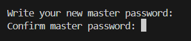
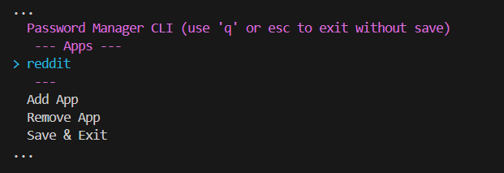
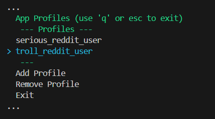
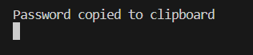

# password-manager-cli

## Overview






## manual install

```bash
git clone
cargo build --release
```

## sources

- <https://github.com/RustCrypto>
- PRF: pseudo-random function (<https://en.wikipedia.org/wiki/Pseudorandom_function_family>)
    - <https://crypto.stackexchange.com/questions/50860/the-difference-between-macs-vs-hmacs-vs-prfs>
    - AES-PRF
